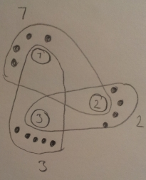

% Advanced Computer Networks
% Assignment 3: Wireless Networks: Part 2
% Michael Bang, March 20th 2014

Question 1
============
Assuming that the pairwise distance between the receiver and A and B is the same, the difference would be that the signal received by the receiver, i.e. the superposition of signals A and B, is going to be influenced much more by what B sends. Since the signal of B is much stronger, it makes it more difficult to interpret whether the signal decoded with A's key is really data sent from A, or just noise. On the other hand, it makes it more clear what the value of B's data is.

The receiver will receive:
\begin{align*}
    A_s &= A_k \cdot A_d = (-1, +1, -1, -1, +1, +1) \cdot +1 = (-1, +1, -1, -1, +1, +1)\\
    B_s &= B_k \cdot B_d = (+1, +1, -1, +1, -1, +1) \cdot -1 = (-1, -1, +1, -1, +1, -1)\\
     R' &= A_s + 5\cdot B_s = (-6, -4, +4, -6, +6, -4)\\
\end{align*}

Allowing the receiver to detect:
\begin{align*}
    A_d &= R' \cdot A_k = 6 - 4 - 4 + 6 + 6 - 4 = 6\\
    B_d &= R' \cdot B_k = -6 - 4 - 4 - 6 - 6 - 4 = -30
\end{align*}

On the lecture slides, the results obtained above are divided by the length of the code for each terminal. I haven't done that since it isn't done the same way in the course litterature. This doesn't seem very important though, as it would change both results by the same factor.

Since the receiver might interpret $A_d$ as noise, this can be considered an instance of the near far problem, where the solution is to dynamically adjust the power with which the terminals transmit. In this case we assumed that A and B were at an equal distance from the receiver, which means that we can solve the problem by making A and B transmit with the same power.

Question 2
============

a)
----
Adding noise to the signal gives:
\begin{align*}
    \text{Noise} &= (+1, -1, 0, +1, 0, -1)\\
    R'' &= R + Noise = (-1, -1, 0, -1, +2, -1)
\end{align*}

Meaning that the receiver can detect:
\begin{align*}
    A_d &= R'' \cdot A_k = 1 - 1 + 0 + 1 + 2 - 1 = 2\\
    B_d &= R'' \cdot B_k = -1 - 1 + 0 - 1 - 2 - 1 = -6
\end{align*}

The added noise means that it is more difficult to detect which bit A sent, while it is still reasonable to assume that the bit B sent can be correctly detected to be a 0.

b)
----
Considering the near/far problem as well adds even more variables to be considered, meaning that we also have to consider pairwise distance between transmitters and receiver, as well as the power with which the transmitters transmit.

Question 3
============
If the computer, C, has two masters, it can send with twice the data rate to two different piconets. If the receiver, R only has one bluetooth receiver (one slave) this doesn't increase the throughput from C to R, as R can only participate in one piconet. If, on the other hand, R has two bluetooth receivers (two slaves) it can participate in two networks at once, allowing for the data rate to be doubled.

Question 4
============
In the bluetooth stack itself, there is no way to allow devices in different piconets to communicate with each other, even if one device is part of both piconets, creating a scatternet. This layer has to be built on top of the bluetooth stack.

Assuming that the layer described above is implemented, one way to arrange such a network would be to create a 'scatternet-circle', letting the master of each piconet be the slave of the neighboring piconet to the left (or right, as long as it's the same for all masters). On Figure \ref{fig:scatternet} below this is shown for $N=16$, where the numbered nodes are masters of the piconet with the same number, and, at the same time, they are slaves in piconet to their left, i.e. the master (M) of piconet P1 is the slave of piconet P2, M of P2 is a slave of P3, and M of P3 is a slave of P1.

Question 5
============
Bluetooth devices connect to each other by going from the standby state to the connected state, through inquiry and page state. During the inquiry state, the devices discover each other. During the paging state they decide on a master whose clock and hardware address they will use to decide a common hopping sequence unique to the created piconet.

- Standby
    * The Bluetooth device is idle and can only move on to inquiry state, in order to try to connect to another device.

- Inquiry
    * Allows a Bluetooth device to discover or be discovered by other Bluetooth devices.
    * A device in inquiry state can move back to standby or forward to paging state, in order to initiate a connection with another device.

- Paging
    * Allows a pair of Bluetooth devices to form (or expand) a piconet by deciding on a common hopping sequence, determined by the master's hardware address and clock.
    * A device in paging state can move back to inquiry state or forward connected state once a connection has been established.

- Connected
    * A device in connected state is an active part of a piconet (it listens for all messages), but does not reply to the master.
    * A device in connected state can move forward to transmit state in order to xx, or to any of the low power states (park, hold, and sniff) in order to save power.

- Transmit
    * A device in transmit state is actively communicating with its master.
    * A device in transmit state can move to connected or standby state.

- Low power states
    - A device in a low power mode does not actively take part in the network. It still listens for messages from the master, but much less frequently than in the active states (connected and transmitting). A Bluetooth device in parked state even gives up its address in the piconet, allowing for more than 7 slaves to be in the piconet (even though they are not all actively part of it).
    - A master can tell slaves to go to a low power state, and slaves can themselves request to go to a low power state.
    - A device in a low power state can move to the connected state.

Question 6
============

a)
----
Quality of Service can provided by two different means, on the two different types of channels: synchronous and asynchronous.

On a synchronous channel the master and slave initially agree on an interval at which they will communicate, effectively agreeing on a minimum bandwidth for their connection.

On an asynchronous channel slaves are allowed only to "speak when spoken to"; the master of a piconet is responsible for polling the slaves, at which point the slaves may respond in the following slot, perhaps requesting more slots to transmit daa in. This means that, theoretically (I have not been able to find anything that says that this is actually an official part of Bluetooth), the master can set up agreements with its slaves, giving them some minimum amount of times per time interval they are asked to speak. This is very similar to the synchronous channel, but differs in the way that no specific interval for the communication is agreed upon.

b)
----
This has been answered in the section "Low power states" of Question 5.

Question 7
============
It is not practical for small sensors to use GPS because it uses a lot of power, which is often very limited in such sensors. A practical approach to learn of a sensor's location would be to have a more powerful device with a GPS near the sensor, to which the sensor could send an ID (perhaps even along with some of the information that the sensor has collected.) The powerful device doesn't have to be stationary, but could be moved near the sensor as often as the location of the sensor is required to be reestablished, perhaps requesting all nearby sensors to broadcast send their ID.

Question 8
============

a)
----
It is assumed that device A knows which packets $P_X$ other devices $X$ have and haven't received, and which packets these devices were supposed to receive but didn't, so that A can act as a wireless gateway using $P_X$ to encode the packets that these devices didn't receive, but were meant to receive.

This also implicitly assumes that A receives some packet meant for some other device B, which B didn't receive itself, and furthermore that A knows that B didn't receive that packet.

b)
----
One of the tricks that COPE uses, is to piggyback on (cleverly [ab]use) a lot of the functionality of 802.11. For instance, COPE uses 802.11 unicast to do what they call pseudo-broadcasting, leveraging 802.11's retransmission protocol for the addressed receiver, while putting nodes in promiscuous mode, letting them 'overhear' unicast packets that aren't meant for them, allowing for pseudo-broadcast. This means that CODE only has to worry about retransmissions for nodes that weren't directly addressed in the unicast packet. This is done cleverly by leveraging COPE's coding scheme.