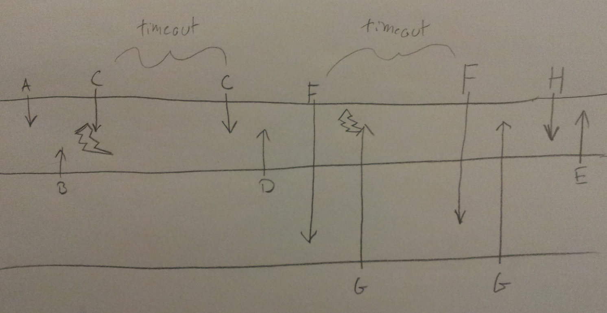

% Advanced Computer Networks
% Assignment 4: Wireless Networks: Part 3
% Michael Bang, March 27th 2014

Question 1
============

a)
----
The figure couldn't be an ACL transmission since the receiver wouldn't know to send a NAK for a packet it didn't receive, as it couldn't know that it was supposed to have received a packet. This is unlike SCO where a receiver knows a rate at which it's supposed to receive packets, and therefore _would_ know to send a NAK if it didn't receive packets at this rate. There are no retransmissions in SCO (but is actually available in eSCO[^1]) though, which is noteworthy.

b)
----
In this case the figure would be correct since the recipient would know that he was supposed to receive a packet but couldn't decode the contents, and therefore should request a retransmission.

Question 2
============
Depending on how S-MAC was implemented, if a node were to send a message that takes longer than one awake-time to send, it would have to postpone sending the later part of the message at least one sleep-time, waiting for the recipient to sleep and return to its awake state.

Assume node $x$ is on schedule $A$, node $y$ is on schedule $A,B$ and node $z$ is on schedule $B$. If $x$ were to send a message to $z$, it would have to use $y$, which is synchronized to both schedule $A$ and $B$, as a relay. It could be the case that schedules $A$ and $B$ are timed such that $z$ is awake in a short period in the beginning of $x$'s transmission, but goes to sleep before the message is relayed from $x$ to $y$. This means that the message will have to wait at $y$ until $z$ wakes up again, introducing a delay to the transmission.

Question 3
============
If node $x$ wants to send a message to node $y$, $x$ will have to send a preamble for at least $\text{sleep time} + \epsilon$, in order to make sure that $y$ is awake and listening for the transmission. This means that if the nodes are sending small messages, the time spent transmitting actual data will be a small fraction of the total time spent transmitting. This means that a lot of both power and time will be "wasted" on sending the preamble.

Question 4
============
\begin{align*}
    \text{Symbol duration} &= \frac{1}{500000} = 2 \mu s\\
    \text{Time between rays} &= 1 \mu s\\
    \text{Inter-symbol interference} &= 1 / 2 = 50\%
\end{align*}

We see that the inter-symbol rate is very high, meaning that it will be difficult to correctly decode the signal correctly at the receiver.
\\
\\

In the following I do not account for guard-space needed between sub-channels.

If we instead spread the symbols over 10 sub-channels, it will take 10 times longer to send each symbol, but 10 symbols will be sent simultaneously, meaning that the total transmission time of the 10 symbols will take the same amount of time. Using this trick gives us less inter-symbol interference:

\begin{align*}
    \text{Symbol duration} = \frac{10}{500000} = 0.000002 s = 20 \mu s\\
    \text{Time between rays} = 1 \mu s\\
    \text{Inter-symbol interference} = 1 / 20 = 5\%
\end{align*}

This decreases the inter-symbol interference greatly, meaning that it will be easier to decode the signal correctly at the receiver.

Question 5
============

% Read paper

a)
----

b)
----

Question 6
============
This would be a problem because the priority of packets would be inverted, making it very difficult for ACKs, for instance, to reach the receiver, since the medium would be constantly occupied by data packets.

Question 7
============
As can be seen on slide 22 from lecture 5, instead of each station choosing a new random backoff time each time the channel has been busy, the stations keep decreasing the initially 'chosen' backoff time as time passes. This has the effect that stations are increasingly more likely to get the channel as time passes. This technique (almost) avoids the problem that a station continuously chooses a random backoff time that is greater than some other station's backoff time, such that that the first station never gets to use the channel.

[^1]: https://www.bluetooth.org/docman/handlers/DownloadDoc.ashx?doc_id=40211&vId=41552